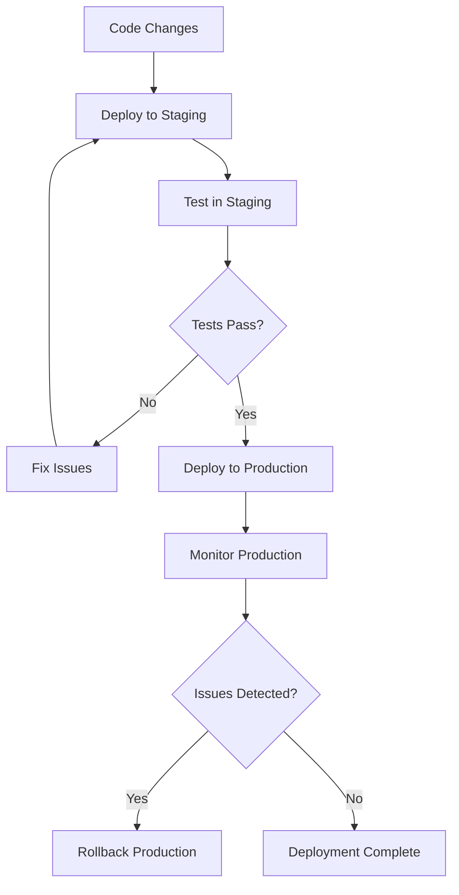

# Multi-Environment Deployments

This guide covers the workspace-based multi-environment approach that enables complete separation between staging and production environments while maintaining a single codebase.

## Overview

The infrastructure uses a **workspace-based approach** with environment-specific configuration files and separate Terraform state backends to ensure complete isolation between environments.

### Key Benefits

- ✅ **Zero File Duplication** - Single source of truth for all environments
- ✅ **Complete Resource Separation** - No shared infrastructure between environments
- ✅ **Independent State Management** - Separate S3 backends prevent cross-environment corruption
- ✅ **Environment-Specific Optimization** - Different scaling and cost settings per environment
- ✅ **Easy Deployment Scripts** - One-command deployments to any environment

## Architecture

```
Project Structure:
/
├── main.tf                      # Single source of truth
├── modules/                     # Reusable environment-aware modules
├── terraform.tfvars.staging     # Staging configuration
├── terraform.tfvars.production  # Production configuration
├── backend-staging.tfbackend    # Staging S3 state config
├── backend-production.tfbackend # Production S3 state config
├── deploy-staging.sh            # Staging deployment script
├── deploy-production.sh         # Production deployment script
└── switch-env.sh               # Environment switching utility
```

## Environment Separation

### Infrastructure Naming

All resources include the environment name for clear identification:

**Staging Environment** (`environment = "staging"`):
```
- Load Balancer: mht-api-staging-lb
- EC2 Instances: mht-api-staging-0, mht-api-staging-1
- S3 Bucket: mht-api-staging-raw-data-collection-{hex}
- DynamoDB Table: mht-api-staging-table
- SQS Queues: mht-api-staging-processing-feedback.fifo
- Security Groups: mht-api-staging-alb-sg-*, mht-api-staging-instance-sg-*
```

**Production Environment** (`environment = "production"`):
```
- Load Balancer: mht-api-production-lb
- EC2 Instances: mht-api-production-0, mht-api-production-1, mht-api-production-2
- S3 Bucket: mht-api-production-production-data-{hex}
- DynamoDB Table: mht-api-production-table
- SQS Queues: mht-api-production-processing-feedback.fifo
- Security Groups: mht-api-production-alb-sg-*, mht-api-production-instance-sg-*
```

### State File Isolation

Each environment maintains completely separate Terraform state:

**Staging State:**
```
S3 Bucket: mht-api-terraform-state-staging
Key: staging/terraform.tfstate
DynamoDB: mht-api-terraform-locks-staging
```

**Production State:**
```
S3 Bucket: mht-api-terraform-state-production
Key: production/terraform.tfstate
DynamoDB: mht-api-terraform-locks-production
```

## Configuration Differences

### Environment-Specific Settings

**Staging (Cost-Optimized):**
```hcl
# terraform.tfvars.staging
environment = "staging"
instance_count = 1
instance_type = "t2.micro"
vpc_cidr = "10.1.0.0/16"
dns_name = "staging.api.amygdalas.com"

# Reduced SQS settings
sqs_queue_configurations = {
  feedback = {
    message_retention_seconds = 86400  # 1 day
    visibility_timeout_seconds = 60    # 1 minute
    max_receive_count = 2              # Fewer retries
    alarm_max_depth = 50              # Lower thresholds
  }
}

# Reduced S3 settings
enable_s3_intelligent_tiering = false
enable_sqs_cloudwatch_alarms = false
s3_log_retention_days = 7
```

**Production (Performance-Optimized):**
```hcl
# terraform.tfvars.production
environment = "production"
instance_count = 3
instance_type = "t3.medium"
vpc_cidr = "10.0.0.0/16"
dns_name = "api.amygdalas.com"

# Full SQS settings
sqs_queue_configurations = {
  feedback = {
    message_retention_seconds = 1209600  # 14 days
    visibility_timeout_seconds = 300     # 5 minutes
    max_receive_count = 3                # More retries
    alarm_max_depth = 100               # Higher thresholds
  }
}

# Full S3 settings
enable_s3_intelligent_tiering = true
enable_sqs_cloudwatch_alarms = true
s3_log_retention_days = 90
```

## Deployment Methods

### Option 1: Automated Scripts (Recommended)

**Deploy to Staging:**
```bash
./deploy-staging.sh
```

**Deploy to Production:**
```bash
./deploy-production.sh
```

### Option 2: Manual Commands

**Staging Deployment:**
```bash
# Initialize with staging backend
terraform init -backend-config=backend-staging.tfbackend -reconfigure

# Plan with staging variables
terraform plan -var-file=terraform.tfvars.staging

# Apply staging configuration
terraform apply -var-file=terraform.tfvars.staging
```

**Production Deployment:**
```bash
# Initialize with production backend
terraform init -backend-config=backend-production.tfbackend -reconfigure

# Plan with production variables
terraform plan -var-file=terraform.tfvars.production

# Apply production configuration
terraform apply -var-file=terraform.tfvars.production
```

### Option 3: Environment Switching

Switch environments without deploying:

```bash
# Switch to staging
./switch-env.sh staging

# Switch to production
./switch-env.sh production
```

## Development Workflow

### Typical Development Flow



### Best Practices

1. **Always Test in Staging First**
   ```bash
   # Test changes in staging
   ./deploy-staging.sh
   
   # Validate functionality
   curl https://staging.api.amygdalas.com/health
   
   # Deploy to production only after validation
   ./deploy-production.sh
   ```

2. **Use Environment-Specific DNS**
   - Staging: `staging.api.amygdalas.com`
   - Production: `api.amygdalas.com`

3. **Monitor Resource Costs**
   ```bash
   # Check resource tags for cost allocation
   aws resourcegroupstaggingapi get-resources \
     --tag-filters "Key=Environment,Values=staging"
   ```

4. **Validate State Separation**
   ```bash
   # Verify staging state
   terraform init -backend-config=backend-staging.tfbackend
   terraform state list
   
   # Verify production state
   terraform init -backend-config=backend-production.tfbackend
   terraform state list
   ```

## Environment Variables for Applications

Your applications can use environment-specific configurations:

**Staging Environment Variables:**
```bash
export ENVIRONMENT=staging
export DATABASE_URL="mht-api-staging-table"
export S3_BUCKET="mht-api-staging-raw-data-collection-{hex}"
export FEEDBACK_QUEUE_URL="mht-api-staging-processing-feedback.fifo"
export API_BASE_URL="https://staging.api.amygdalas.com"
```

**Production Environment Variables:**
```bash
export ENVIRONMENT=production
export DATABASE_URL="mht-api-production-table"
export S3_BUCKET="mht-api-production-production-data-{hex}"
export FEEDBACK_QUEUE_URL="mht-api-production-processing-feedback.fifo"
export API_BASE_URL="https://api.amygdalas.com"
```

## Migration from Single Environment

If you're migrating from a single environment setup:

1. **Backup Current State**
   ```bash
   terraform state pull > backup-state.json
   ```

2. **Tag Current Resources as Staging**
   ```bash
   # Current deployment becomes staging
   cp terraform.tfvars terraform.tfvars.staging
   sed -i 's/environment = "production"/environment = "staging"/' terraform.tfvars.staging
   ```

3. **Deploy Staging Environment**
   ```bash
   ./deploy-staging.sh
   ```

4. **Create Production Environment**
   ```bash
   ./deploy-production.sh
   ```

5. **Update DNS Records**
   - Point staging subdomain to staging load balancer
   - Point production domain to production load balancer

## Troubleshooting

### Common Issues

**State Backend Conflicts:**
```bash
# Error: Backend configuration changed
# Solution: Use -reconfigure flag
terraform init -backend-config=backend-staging.tfbackend -reconfigure
```

**Resource Name Conflicts:**
```bash
# Error: Resource already exists
# Solution: Import existing resources or use different names
terraform import module.alb[0].aws_lb.app_lb existing-lb-arn
```

**Environment Variable Not Applied:**
```bash
# Check if environment variable is properly passed to modules
terraform plan -var-file=terraform.tfvars.staging | grep -i environment
```

### Validation Commands

**Verify Environment Separation:**
```bash
# List staging resources
aws resourcegroupstaggingapi get-resources \
  --tag-filters "Key=Environment,Values=staging" \
  --query "ResourceTagMappingList[].ResourceARN"

# List production resources
aws resourcegroupstaggingapi get-resources \
  --tag-filters "Key=Environment,Values=production" \
  --query "ResourceTagMappingList[].ResourceARN"
```

**Check Resource Naming:**
```bash
# Verify all resources include environment in name
terraform state list | grep -E "(staging|production)"
```

## Related Documentation

- [Zero-Downtime Deployments](zero-downtime-deployments.md) - Blue-green and rolling deployment strategies
- [Module Documentation](modules/) - Individual module configuration guides
- [White Label Examples](white-label/) - Complete configuration examples
- [Scaling Architecture](scaling-architecture.md) - Performance and scaling considerations

## Security Considerations

- **Separate IAM Roles**: Each environment has isolated IAM roles and policies
- **Network Isolation**: Different VPCs and security groups per environment
- **Secret Management**: Use different AWS Secrets Manager entries per environment
- **KMS Keys**: Consider separate KMS keys for production encryption

## Cost Optimization

- **Staging**: Uses smaller instances, reduced monitoring, shorter retention periods
- **Production**: Full monitoring, larger instances, longer retention for compliance
- **Resource Tagging**: All resources tagged with environment for cost allocation
- **Scheduled Scaling**: Consider auto-shutdown for staging resources during off-hours

Last Updated: January 2025